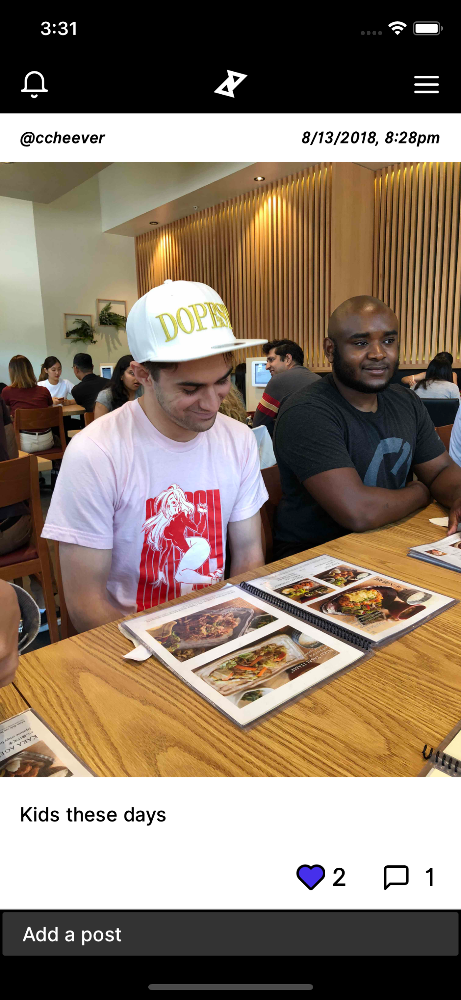
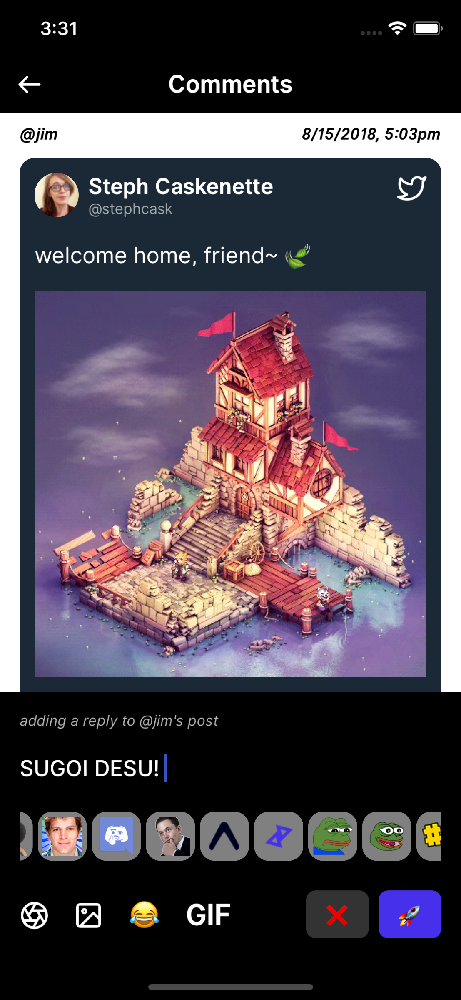

<p align="center">
  
</p>

<h3 align="center" style="font-weight:600">
  Expo Blue
</h3>

<p align="center">
  A discussion app for small groups
</p>

---

## Screenshots

<p align="center">
  
  
   
</p>

[🧠 Development Braindump](./BRAINDUMP.md)

[📱 Expo/RN app](./pound-random-app/index.js)

[⚙️ Server/Backend](./pound-random-app/index.js)

To run your own instance of this app, you must deploy your own server and build a version of the app from source.

### Deploy your own backend

1. Create a MySQL db and run the sql commands found in `server/schema.sql` to generate all necessary tables and the alterations in `server/charset.sql` to enable utf8/emoji support.

1. create a folder under `server` named `pound-random-secret` with an index.js file shaped like:

   ```js
   module.exports = {
     database: {
       host: String,
       user: String,
       password: String,
       database: String,
     },
     twilio: {
       AccountSid: String,
       AuthToken: String,
       From: String,
     },
     twitter: {
       apiKey: String,
       apiKeySecret: String,
       accessToken: String,
       accessTokenSecret: String,
     },
     cloudinary: {
       cloudName: String,
       apiKey: String,
       apiSecret: String,
       envVar: String,
     },
   };
   ```

1. Deploy this to a service like Now.sh

1. Change `pound-random-app/Api.js`'s `PRODUCTION_API_BASE_URL` and `PRODUCTION_WS_URL` variables to point towards your server.

### Build from source

1. `cd <ROOT>/pound-random-app`
1. Change the `bundleIdentifier` and Android `package` name to your own namespace
1. Sign in to Expo CLI and run `expo build <platform>`
1. Download your artifactm distribute it however you please, and enjoy!
